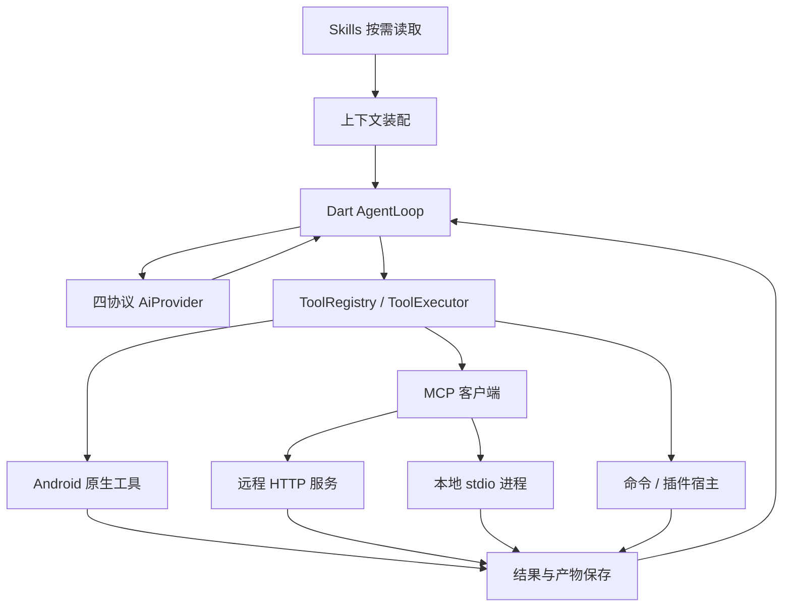

# 相月 Agent 与扩展设计

更新：2026-09-19｜状态：扩展目标设计；E1/E2 已实现；E3 已接入，本机四协议与真机安装/进程桥通过，完整 UI/生命周期待验收

本文件细化扩展目标；E1 远程 MCP、E2 Skills、E3 工作区与命令已接入，实际支持范围与验证缺口以实施计划第 3–5 节为准，其余章节仍是待实现设计。现状与基础契约见 [产品设计](./product_and_technical_design.md)，实施顺序与交付清单见 [实施计划](./implementation_plan.md)。数据结构名称是设计名称，实现时与当前模型统一，不预建空表、空页面或第二套运行框架。

## 1. 目标与选型

目标是让同一会话可靠使用远程工具、任务指导、Linux 程序和 Android 能力，同时保留现有四协议、公开思考、停止、确认和记录机制。

| 层次 | 选型 | 边界 |
|---|---|---|
| 主循环 | Dart `AgentLoop` + 现有 Controller/Repository | 模型轮次、工具派发和运行终态只有一处决策 |
| 工具接入 | `ToolRegistry` / `ToolExecutor` | 内置、MCP、进程与插件工具走相同策略和结果保存 |
| 通用生态 | MCP Streamable HTTP + stdio；Skills | 通信标准和指导格式不绑定某个 Agent 框架 |
| 本地环境 | 按需下载 Ubuntu 24.04 ARM64 rootfs + PRoot | 程序运行环境，不承载另一套 Agent 内核 |
| 依赖运行时 | Node.js/npm、Python/uv 按任务安装 | 用于 MCP 服务或脚本，不成为普通聊天的前置条件 |
| 系统能力 | 无障碍、Shizuku、Termux 显式通道 | 独立身份、目录和授权；不在失败后自动换通道 |
| 应用扩展 | 数据声明包先行，Node 宿主钩子后续 | 不承诺直接加载 Pi 扩展或 Operit ToolPkg |

参考项目的可复用思路：Kelivo 的 Dart 工具循环与原始管道 stdio，RikkaHub 的统一工具工厂与 nativeLibraryDir 启动 PRoot，Operit 的工具包生命周期，Aether 的运行环境/模型工具分离。它们都是设计参照，不证明相月的兼容性或设备验收已经完成。

### 1.1 环境与体积

默认选择 Ubuntu 24.04 的 glibc 用户空间，提高常见 ARM64 Node/Python 原生依赖的适配机会；不承诺任意桌面二进制可运行。Alpine 作为以后有明确体积需求时的独立环境选项，不在第一次实现中同时维护多发行版。

Aether 基础 Alpine 的本地资源测算约为 4.11 MiB 打包前、8.54 MiB 解压文件内容，仅供认识最小环境成本；这不是 Ubuntu、Node/Python 或相月成品 APK 的体积预算。相月环境清单记录真实下载大小、安装大小和依赖增量，UI 只显示实测/清单提供的数字。

PRoot 和 loader 随 APK 按 ABI 放入 `jniLibs`，从 `nativeLibraryDir` 启动，rootfs 与用户工作区独立存放。保留当前 compileSdk 37，不以降低 targetSdk 实现执行能力；当前 targetSdk/ABI/设备上的 exec、loader 和取消行为必须通过 E3 验收。

### 1.2 运行与信任边界

初次实现把 PRoot 进程放在应用 UID 内，只运行用户明确安装和信任的程序；不能把路径映射或只读 UI 开关称为强隔离。任意 Shell 程序可能访问该 UID 可访问的数据，不能声称 ToolExecutor 能约束脚本内部的每次文件访问。宿主不主动把业务库、密钥存储、手机公共目录或设备控制凭据挂入环境，也不提供通用读密钥 API。

支持不可信程序需另立独立 UID/宿主隔离设计。MCP/Skill 的文本内容始终作为有来源的数据，不提升为应用规则。

## 2. 同一循环中的扩展契约

### 2.1 职责与代码位置



| 职责 | 目标位置 | 说明 |
|---|---|---|
| 轮次、策略、结果与预算 | `lib/features/tools/` | 延续现有 AgentLoop/ToolExecutor |
| 上下文装配、摘要 | `lib/features/chat/` | 根据扩展需求从 Controller 提取，不移动 Provider 业务边界 |
| MCP 连接、目录与配置界面 | `lib/features/mcp/` | MCP 协议是工具接入，不放进模型 `lib/providers/` |
| Skill 安装、索引与按需读取 | `lib/features/skills/` | 文件和指导管理，执行仍调用注册工具 |
| 环境、工作区、命令和终端 | `lib/features/workspace/` | 调用原生进程契约，不直接从页面发命令 |
| 通用插件包与宿主钩子 | `lib/features/extensions/` | 在实际插件需求出现时加入 |
| 配置/状态/记录 | `lib/data/models/`、`repositories/`、`datasources/` | 不为每个功能机械增加 entity/service/manager 三层 |
| Android 进程和通道 | `pigeons/`、Android `execution/` 及新增 `runtime/` | 类型化生成桥接，Kotlin 不维护独立业务库 |

### 2.2 工具身份与运行快照

现有 `Tool.name`、`inputSchema`、`execute` 保持统一入口。动态工具增加稳定来源：`sourceKind`、`sourceId`、`originalName`、`definitionRevision`、`effectClass`，与记录中的执行通道分别表达，MCP 不等同于 Android 通道。

- MCP 的模型侧名称使用 `mcp_<serverId片段>_<工具名规范化片段>_<短摘要>`，遵守四协议共有的长度/字符限制；持久化映射回 serverId 和原名，不按显示名称反解。碰撞检测必须在注册时完成。
- 来源 ID 不随显示名称变更，定义修订覆盖 schema、权限范围和执行目标；完整连接配置仍不含密钥。
- 开始运行时固定工具定义、连接版本、Skill 版本、环境/工作区与允许范围。配置更新用于新运行；正在运行时禁用或撤销立即阻止后续派发，新增许可不扩大快照。
- 服务端工具清单变更不能无声替换已确认的定义；旧定义不可用时返回工具定义变化错误，由新运行重新选择。
- 动态工具默认不进入助手；用户启用后默认 ask。未知 effectClass 不能在 Plan Mode 当作只读工具。

### 2.3 状态、结果和取消

保持产品设计中的 ToolCallRecord 状态机。安装、连接、进程事件是各自生命周期，不增设“执行结果待用户核验”。工具结果包含文本/结构化内容、isError、产物和必要的截断信息；Provider 仅做协议编码。

模型重试与工具执行分开。任何通道断连都不能自动重发已派发调用。无未决业务调用时可以重建连接；有未决调用时先按连接失败保存已有信息，不能以重连掩盖失败或重放历史操作。

## 3. 远程与本地 MCP

<a id="extensions-mcp"></a>

### 3.1 用户流程与配置

“扩展 → MCP 服务”提供新增、编辑、连接检查、工具列表和删除。首批实现并开放 Streamable HTTP；本地 stdio 随进程能力接通后开放。旧 SSE 传输只有存在实际服务器需求时再独立实现，不自动探测切换。

`McpServerProfile` 目标字段：id、name、transport、endpoint 或 localLaunch、credentialRef、非敏感 headers、enabled、连接/调用超时、definitionRevision、createdAt/updatedAt。localLaunch 包含 environmentId、workspaceId、executable、argv、cwd、普通环境变量及密钥引用。transport 用有区分的类型建模，不能同时保存两套冲突的运行地址。

- 首批远程鉴权支持无凭据和 Bearer 引用；敏感头统一进入安全存储。OAuth 单列后续任务，未实现时明确提示，不以普通表单声称支持。
- 连接检查执行 initialize、能力协商、tools/list，显示实际协商结果；成功仅代表连接/发现，不执行工具验证“可用”。
- 工具列表显示原名、说明、输入 schema 和助手开放情况。添加服务器不等于向所有助手开放全部工具。
- 修改端点、传输、启动程序和工具定义后，下一运行重新建立快照；删除前停止相应连接并处理凭据删除失败的重试，不自动删除共享工作区。

### 3.2 协议与会话

实现所声明版本的 MCP 初始化、请求 ID、错误和通知；按规范处理 HTTP JSON/SSE 响应、会话 ID、分页工具列表及 tools/list_changed。协议版本由客户端支持集合与服务端协商，不猜私有字段。

连接具有 disconnected/connecting/ready/failed/closing 状态。session ID、请求路由与订阅属于运行期对象，不从旧数据库“恢复一个仍有效的网络会话”。同一服务会话可复用连接，工具调用仍服从根任务的顺序。关闭取消挂起请求、读流与底层连接，不能只改 UI 状态。

首批客户端只声明已实现能力；服务端发起的 sampling、elicitation 等请求不自动调用模型或索取用户输入，未实现时按协议返回不支持。连接允许跨模型轮复用，但按服务器配置修订和实际数据范围隔离，不能把另一会话的工作区通过全局连接共享。

调用超时、网络错误和 MCP isError 如实成为工具结果；HTTP 已发送但响应丢失也不自动重试工具。取消发送协议支持的取消通知并终止本地等待，不声称远端已经撤销效果。服务端未声明的资源/提示词能力不生成假入口。

### 3.3 结果与上下文

- 文本、structuredContent、图片和 resource link 按实际类型转换。图片经现有附件/模型能力链路，关闭图片能力不读取或发送图片字节。
- 不支持的内容类型返回明确说明；远程资源链接不自动下载，读取需明确的后续工具调用与权限。
- 保存业务结果，模型侧按上下文预算限长，过大的内容保存产物引用。不得将任意远程 URI 当成本机路径访问。
- 本批先完成 tools；MCP resources/prompts 独立排期，协议支持列表不得预报已实现。

### 3.4 本地 stdio

依赖 §6 原始进程管道，不依赖交互终端或 Termux RUN_COMMAND。Dart MCP 客户端直接读写本地服务的 stdin/stdout，stderr 独立作为有界业务详情保存，禁止原样写 AppLogger；不额外常驻 Node“通用 MCP 桥”。Node 或 Python 只是具体服务自己的运行时。

- 启动程序使用 executable + argv，明确环境、cwd 和环境变量，不拼接用户提供的 shell 命令。
- stdout 专用于 MCP 帧，按规范逐行解析 JSON；覆盖 UTF-8 分片、多条消息合并、乱序响应和上限。PTY 的回显、颜色和 stderr 混流不能进入协议。
- 服务进程随连接创建，连接关闭/失效取消请求后终止进程并回收管道。模型轮之间保持连接；应用进入后台且无活动任务时关闭空闲本地会话，不为闲置服务器永久保活。
- 运行时缺失显示具体依赖与安装入口。安装依赖是用户操作或独立工具调用，不在 tools/call 内暗中下载执行；npx/uvx 等启动器先解析并安装固定版本，运行时禁止隐式安装或拉取 latest。

### 3.5 验收

可控远程服务器覆盖鉴权、分页、定义变化、JSON/SSE、超时、断连后不重发；本地测试服务覆盖双向字节、stderr 污染隔离、进程退出、取消、关闭与僵尸进程回收。四协议各跑一次“模型调用 MCP → 保存 → 结果回填 → 最终回答”，使用假凭据，不以假 Tool 流替代真实适配器链路。

## 4. Skills

<a id="extensions-skills"></a>

### 4.1 导入与格式

首批支持用户选择本地 Skill 目录或 ZIP，单个 Skill 包含 `SKILL.md` 及 resources/scripts 等相对资源。必需 frontmatter 为 name、description；版本与安装来源由应用管理。只解析明确支持的可选字段，未知字段给出说明，不当成权限声明。

安装在 staging 目录，检查包大小/解压总量、路径穿越、符号链接逃逸、重名和入口，再原子切换版本。导入只检查与复制文件，不执行安装脚本。网络仓库安装/更新后续接入同一安装器，不运行下载内容中的自安装命令。

`SkillInstallation`：id、name、description、版本/内容摘要、source、installedPath、安装时间；助手保存启用 ID。删除或禁用即时阻止后续读取；活跃运行引用的旧版本延迟清理。

### 4.2 发现与按需读取

上下文只常驻已启用 Skill 的 ID、简述；提供 `read_skill(skillId, relativePath?, offset?)`，默认读取 SKILL.md，返回版本、来源与实际内容。资源路径限定在该 Skill 目录，超长内容可分段读取。

E3 工作区接入后，需要脚本时将本次启用 Skill 的固定版本资源复制到工作区专用目录并返回 guest 路径；记录安装 ID/版本与副本关系，不把 Android 私有 host 路径交给 guest 执行。安装原件不随脚本修改，工作副本作为工作区文件管理。

Skill 指导不覆盖应用规则、当前用户要求或权限。读取脚本不执行脚本；脚本调用经明确的 `shell`/注册工具。纯文本 Skill 无需 Linux；脚本环境未安装时返回缺失能力，不触发静默安装或换环境。

### 4.3 界面与验收

“扩展 → Skills”显示名称、来源、安装版本、资源和删除；助手编辑选择启用范围。导入失败保留原版本和选择，取消不落半成品。验证同名包、损坏 ZIP、越界引用、按需加载、停用和卸载；完整跑通“读取 Skill → 读取文档 → 通过现有文件工具生成产物”。

E2 当前实现：上述本地导入、助手范围、版本固定、管理界面和按需文本读取已接通。读取默认 ask，可在助手中调整；结果包含内容摘要版本和来源，按 `nextOffset` 继续读取。ZIP/目录的实际边界、四协议闭环与未验收项见实施计划第 4 节；脚本查看不执行脚本；E3 的 `prepare_skill` 复制固定版本，实际执行通过 `shell`。

## 5. Linux 环境与工作区

<a id="extensions-runtime"></a>

### 5.1 环境生命周期

`RuntimeEnvironment`：id、发行版/版本、ABI、镜像来源与摘要、状态、安装目录、已安装依赖版本和可测量大小。首批一个 Ubuntu 环境供多个独立工作区使用。

状态：notInstalled → downloading → verifying → extracting → checking → ready；失败进入 failed，取消进入 cancelled，保留可清理的临时目录和此前可用安装。只有 shell、文件读写、进程退出码检查都通过才能 ready。

- 镜像清单固定发行版修订、ABI、可信发布摘要和来源，校验下载内容；断点续传需校验资源一致性，不能把截断包标为安装完成。
- 解压到 staging，防路径穿越、链接逃逸与解压超额；空间检查覆盖压缩包、解压和替换时峰值占用。
- 首批仅声明通过验收的 ARM64；其他 ABI 明确不可用，不静默下载错误架构。
- 更新环境时要求无活跃命令/MCP 会话，先准备新目录并检查，再切换。初次不做在线发行版升级和进程热迁移。
- 重置/卸载是独立用户动作，显示影响；默认保留工作区，连工作区删除需单独选择。环境和工作区数据操作不借安装失败自动触发。

### 5.2 工作区与文件

`Workspace`：id、name、environmentId、rootPath、createdAt/updatedAt。会话可绑定工作区，一次运行固定绑定；无绑定时 shell 不开放。切换环境/工作区作用于新运行。

- 每个工作区有自己的持久文件目录，映射为 `/workspace`；命令 cwd 必须是明确的 guest 路径。普通文件工具校验规范化路径和链接目标，避免误操作别的工作区。
- 导入附件生成工作区副本并记录来源，产物按现有 Attachment 机制登记。SAF 外部文件采用明确导入/导出，不假设 content URI 是可 bind 的文件路径。
- 删除工作区显示关联会话与活动进程，先结束活动使用再处理文件；历史消息保留，并如实显示不可读的外部引用。复制会话不自动复制整个环境，明确保留或新建工作区绑定。
- 首批不提供任意宿主目录挂载、跨工作区并发写入或工作区强隔离承诺。

### 5.3 依赖与终端

环境详情按需安装 Node/npm、Python/uv 和 Git/搜索工具。安装计划显示来源、用途与可用体积信息；固定本次解析的包版本并记录实际结果，安装失败保留已有环境。依赖安装可取消，不把取消描述成完全回滚软件包操作。

基础命令与 stdio 先完成，再提供 PTY 终端：输入、窗口尺寸、Ctrl-C、退出与会话切换。关闭终端页面不等于结束有明确宿主的任务；终端退出操作必须终止自己的进程。交互终端不暴露给模型充当 MCP 传输。

### 5.4 服务与性能

环境安装、长命令和活动本地 MCP 按用户可见任务管理 Android 生命周期；扩展现有执行宿主的任务类型与通知归属，避免为每个工具创建新 FlutterEngine。前台服务启动、类型、权限和后台限制依实际系统验证，不能把现有设备服务声明直接视为命令宿主已合规可用。

记录初始化耗时、安装峰值空间、命令延迟、流式输出时的 UI/raster 帧和后台停止行为。普通聊天不启动 Linux 进程。rootfs、下载缓存和可重建依赖排除在默认备份之外。

## 6. 命令进程与桥接

<a id="extensions-process"></a>

### 6.1 对上接口

下列为进程契约；E3 已通过独立 `pigeons/process_api.dart` 与 `LinuxProcessHostApi` 接入原始管道，复用单 FlutterEngine/执行服务。`ExecutionHostApi.execute` 继续负责单次设备动作。PTY、MCP 会话及其独立输出预算随后续阶段接入。

```text
ProcessSpec
  ownerId / runId? / toolCallId? / environmentId / workspaceId
  executable / argv / cwd / environmentValues / secretRefs
  ioMode: pipes | pty
  timeoutMs / outputLimitBytes

ProcessHandle
  processId                         # 应用生成的 ID，不复用 OS PID
  events: started | stdout | stderr | exited
  writeStdin(bytes) / closeStdin()
  resize(rows, columns)              # 仅 PTY
  cancel() / close()

ProcessExit
  exitCode? / signal? / cancelled / timedOut / outputLimitExceeded
  startedAt / finishedAt / knownEffects / artifactIds
```

通过独立 Pigeon 进程 API 实现，复用运行宿主、错误和取消规则，不复制 AgentRun 数据库。ownerId 区分模型运行、MCP 连接和用户终端；启动/写入/取消验证归属，禁止其他会话控制旧句柄。字节块含 processId、流类型和 sequence；在接收方做 UTF-8 增量解码，不逐块强行转字符串。

Dart 在派发时通过安全存储解析允许的 secretRefs，仅以运行期环境变量交给对应进程，不写入运行快照、启动日志或明文配置文件。每个连接/进程独立限制环境变量范围，不继承宿主全部环境。knownEffects 只记录已观察到的事实，不能根据退出码推断任意脚本完成了哪些业务动作。

### 6.2 命令工具

`shell(command, cwd?, timeoutMs?)` 默认 ask，确认展示工作区、环境、完整命令和超时。环境/工作区来自固定运行配置，模型不能通过参数临时切成 Shizuku/Root。内部以 argv 调用选定 shell；MCP 服务则直接启动 executable，不经过 shell 解释。

首批每次 shell 是独立非交互进程，变量、cd、alias 不跨调用持久；文件变化保留。默认超时 60 秒，上限 5 分钟；更长任务在明确后台任务句柄设计后支持，不把无限超时作为默认。MCP 服务生命周期不套用 shell 的五分钟上限，工具调用仍有独立期限。

初始模型预览每路最多 64 KiB，完整输出以有界产物保存，默认总上限 8 MiB；达到总上限停止进程，记录截断与此前效果。数值集中配置，不能在 Dart/Kotlin 各写一套。大输出不全塞入数据库、平台消息或内存；工具卡片可查看保存的完整输出/产物。

上述 8 MiB 是单次 shell 保存上限，不作为长期 MCP/PTY 会话的累计输出上限。MCP 另限单帧/单次工具结果和 stderr 缓冲，超限返回协议错误并结束对应请求或连接；PTY 限制滚动历史，不把屏幕缓冲满当作命令失败。

### 6.3 资源与取消

- stdout/stderr 同时消费，stdin 串行写入且可显式关闭；使用有界队列和背压，防止管道互相等待。退出事件要等尾部输出消费完后交付一次。
- 取消/超时先停止新输入与子任务派发，向受管理进程组发送终止，短宽限后强制结束，等待回收并关闭所有 FD。不要只销毁 Java Process 外壳而遗留子进程。
- 待启动即停止、无输出长进程、子进程、持续输出、stdin 等待和 Activity 重建分别验证。旧 processId 的回调不能污染新任务。
- 进程死亡保存实际退出/信号和已收输出；应用进程重启不恢复旧 PID 句柄、不自动重跑命令。中断记录按现有工具规则回填，AI 可以另行查询文件现场。
- 命令产物写入失败是工具错误，运行记录保存失败是 StorageFailure；输出包含敏感内容时同样只作为业务数据保存，不进入 AppLogger。

### 6.4 验收

先用固定脚本跑通“创建文件 → stdout/stderr → 非零退出 → 产物回填”，再用固定本地 MCP 进程跑双向管道。真机验证 nativeLibraryDir 执行、ABI、目录映射、长输出、服务停止、父子进程清理和文件描述符回收。JVM 假进程测试不能替代这些结果。

## 7. Shizuku 与 Termux

<a id="extensions-channels"></a>

### 7.1 Shizuku

用户依次看到未安装、未运行、未授权、已授权和具体能力状态。以 shell 身份 UserService 提供第一条单次命令链路，明确 executable/argv、cwd、退出码与输出；不把 Root 当作自动替代。

Binder 只控制任务，大输出走管道/文件，工作不阻塞 Binder 接收线程。绑定中、执行中断连、撤权、超时和停止都要收尾；重连不重做命令。设备动作仍共用原来的设备队列，不能因走 Shizuku 绕开应用名单和动作确认。任意 shell 命令的权限影响按实际身份展示，不能承诺逐项受控于无障碍工具名单。

### 7.2 Termux

通过 RUN_COMMAND 传程序、argv、cwd、后台标记，PendingIntent 回调关联应用侧 toolCallId。检查安装、运行权限、allow-external-apps 和所需程序；在 Termux 自己的 UID/目录执行，不能当作 Ubuntu 工作区或系统 shell。

首批交付单次命令时同时实现受管理 runner、运行 ID、日志位置和进程终止协议，支持输出、明确退出码、超时与取消，不用文本哨兵猜成功。没有停止回执时如实记录未能终止/已有信息，不返回“已撤销”。

Termux 不是本地 MCP stdio 的首发依赖；只有用户明确需要 Termux 中的服务器时，再实现带鉴权的双向桥与其生命周期，不把 RUN_COMMAND 的单次回执当成 stdin/stdout 会话。

### 7.3 验收

各通道独立完成安装/授权/撤销/失败引导、一次命令、部分输出、非零退出、停止和进程终止测试。Linux、Termux、Shizuku 的相同命令名仍分别测试，界面显示实际执行环境与身份。

## 8. Plan Mode、上下文与记忆

<a id="extensions-planning"></a>

### 8.1 Plan Mode

同一 AgentLoop 增加 plan/execute 模式。plan 只开放宿主确定的只读工具；通用 shell 和未确认能力的第三方 MCP 不因描述包含“read”而放行。范围受限的宿主文件读取可以开放。

通过专用 `submit_plan` 工具提交版本化计划，只有宿主收到有效结构才生成计划卡；该工具只保存计划，不执行外部动作。用户可编辑、批准或取消。保存计划正文、来源运行、修订和批准状态；批准针对当前版本，修改后需重新批准。执行创建关联的新 AgentRun，读取最新配置与权限，以批准计划为输入；计划批准不代替具体工具确认。UI 提供明确的模式和计划卡，不从正文关键词猜计划已被批准。

### 8.2 上下文预算与摘要

先实现 ContextBuilder 的预算，再引入自动摘要。预算使用模型配置、预留输出和工具定义体积；API usage 与本地估算分开标识。保留当前任务、最近完整交互、成组工具调用/结果和必要产物引用。

`ContextSummary` 记录 conversationId、分支末端/覆盖消息 ID 与摘要版本、来源模型、正文和时间。摘要是派生材料，不删除历史、不替代消息树；切分支或编辑覆盖范围后失效重建。不能把未完成调用、用户拒绝、外部动作结果和任务约束概括丢失。

摘要请求单独记录用量，可停止；失败使用仍在预算内的上下文，放不下则提示新会话/减少输入，不无限重试或静默改模型。第三方内容与摘要保留来源，不成为最高优先级指令。

### 8.3 长期记忆

`MemoryEntry` 包含内容、来源消息/运行、所属助手或全局范围、创建/更新时间、启用状态；用户能查看、修改和删除。显式记忆写入工具默认 ask，读取在启用的范围内使用；普通工具结果和摘要不会自动升级为长期事实。

起步用文本与关键字检索，返回有来源和长度预算的条目。已删除条目不因自动摘要再次写回。向量索引在规模与检索质量需要时再引入，不作为首次记忆功能依赖。

## 9. 插件包与应用扩展钩子

<a id="extensions-plugins"></a>

### 9.1 声明式包

在 MCP 和 Skills 稳定后实现相月扩展包：manifest.json、skills/、MCP 启动声明和可选 resources/。清单只包含 id、name、version、apiVersion、组件、运行时依赖和能力请求，不打包用户凭据。

安装 → 校验 → 显示来源/能力/依赖 → 用户启用 → 加入助手范围。安装不自动运行代码、连接服务器或放开工具。记录文件摘要，升级先暂存并展示能力差异；使用中的版本保持到运行结束，新增权限不自动继承。

卸载停止所属进程并移除注册；共享依赖、工作区与用户产物不随包删除。普通 ZIP 结构、程序名或 Markdown 声明都不是授权。

声明包的工具能力通过 MCP 接入；manifest 中的组件只能指向包内已校验的相对文件，apiVersion 不受支持则拒绝安装并解释原因。首批安装、更新都由用户操作触发，没有后台自动更新。

声明包清单示意（用于确定字段职责，具体 schema 在 E7 随实现固定）：

```json
{
  "id": "document-helper",
  "name": "文档整理",
  "version": "1.0.0",
  "apiVersion": 1,
  "skills": [{"path": "skills/summarize"}],
  "mcpServers": [{
    "id": "documents",
    "transport": "stdio",
    "runtime": "node",
    "entry": "resources/server.mjs",
    "args": []
  }],
  "requestedCapabilities": ["workspace.read", "workspace.write"]
}
```

runtime 和 entry 由宿主映射到已安装解释器及包内文件；工作区、凭据与助手范围在安装后由用户绑定，不写入分发包。能力声明用于展示和配置宿主接口，不是对任意 Node 代码的隔离保证。

### 9.2 程序化钩子

仅在出现实际扩展用例时加入 Node 插件宿主，复用 §6 进程和消息通道，不内嵌第二个 Agent。首批支持工具注册/调用、受限请求上下文补充和运行结束通知；返回的数据由 Dart 校验并写入同一记录。

- 宿主决定钩子顺序、输入字段、时间/输出预算和是否采纳结果。运行配置、工具权限、取消、已派发动作与密钥不可由钩子改写。
- 工具注册固定在运行开始；提示词补充带来源，不能覆盖用户要求/应用规则；结束通知不得偷偷发起新任务。
- 插件崩溃、超时或非法返回定位到该插件，按实际影响结束当前工具/运行；不吞异常后假装插件成功。迟到返回丢弃。
- 插件对 UI 的输出先限定为文本、图片、文件等已有 Part/产物，不加载任意 Flutter/Dart 动态代码，不开放任意页面或原生对象。
- Node 宿主与其他同 UID 本地程序遵守 §1.2 的信任边界；RPC 能力检查不是恶意本地代码的安全沙箱。

纯 JS 表达式求值如果以后需要，可以单独评估 QuickJS；它不等于 Node/npm 运行时。首次插件建设不同时维护两套脚本宿主，也不做跨 Pi/ToolPkg API 兼容层。

本地 Node 宿主使用带请求 ID 的消息协议，至少定义 initialize、tools/list、tools/call、hook/invoke、cancel 和 shutdown；协议 stdout 与业务 stderr 分离。先协商宿主 API 版本再注册，未知方法返回明确错误。输入按扩展许可投影，不能默认传入整段聊天或所有文件。首个实际钩子用例确定后，再固定其 schema 和默认资源限额。

### 9.3 验收

用一个声明包提供 Skill + MCP 文档工具，验证安装/取消/升级/撤权/卸载以及活跃运行版本固定。钩子阶段另用故意超时、崩溃、越权请求和超大输出的本地样本，验证错误归属、停止和已有结果完整保存。

## 10. 单子代理与模型分派

<a id="extensions-subagent"></a>

`SubAgentDefinition` 描述名称、任务用途、提示词、模型选择、工具范围与轮次预算。父运行通过 `delegate_task` 创建独立子 AgentRun，增加 parentRunId/agentId 关联；不复制整段可变父会话，显式传任务和相关输入。

首批最多一个活跃子运行，子代理不能继续委派。父运行等待子结果期间不抢设备队列；子代理使用与父任务许可取交集的工具范围。计划模式父任务不能通过子代理执行写操作。

子结果含结论、产物、失败/取消及已有动作信息，完整子记录可展开查看。停止父任务取消子模型、确认、命令和连接；子进程退出不等于外部动作撤销，也不自动重新委派。父子都受任务总轮次/请求预算约束，避免靠委派绕过限额。

模型在子运行创建时按用户配置选择；失败不静默切协议或改模型。测试父子归因、取消、权限交集、工具部分成功和设备队列让渡，多子代理并发/fork 留后续。

## 11. 其他扩展功能

<a id="extensions-product"></a>

| 功能 | 实现细项 | 完成条件 |
|---|---|---|
| 完整分支导航 | 在已有 parentId 树上展示同级回答、分支选择和来源；切换 currentMessageId，不覆盖旧内容；活动运行禁止切换其执行分支，可继续查看其他历史 | 切分支/重开后上下文一致；附件/工具归属、复制与删除正确；切换不触发新请求或重做动作 |
| 加密备份恢复 | 独立口令、成熟 KDF + AEAD；版本化清单覆盖选定配置、助手、全部分支、运行/工具记录、附件及已选扩展设置；排除 API/MCP 密钥、环境机密、rootfs、下载缓存与运行中句柄 | 认证/清单/哈希全通过后再导入；先预览范围；恢复生成新 ID 并重映射关系，在 staging 与事务中提交，失败清理本次文件并保留原库；错误口令/损坏统一提示，验证停止任务后的一致快照 |
| 原生文档上传 | 按模型/协议显式能力选择；Provider 维护远程文件 ID、来源附件哈希、配置归属、过期与删除；用户可见上传/取消/失败 | 同文件复用有范围，跨端点不复用 ID；无能力时用户明确选择本地抽取，不静默换上传方式；失败不会丢附件草稿 |
| 多 Key | 配置关联 credentialId 列表，凭据仅安全存储；显式启用、顺序与适用规则；一次实际模型请求固定一个 Key | 临时重试仅按用户启用规则选择下一凭据；额度/鉴权状态明确；不改模型/协议，不重做工具；删除部分失败可重试 |
| 按任务选模型 | 助手/子代理用途到 ModelSelection 的显式规则，运行创建前解析并展示实际模型 | 新配置只作用新运行，无隐式错误降级，模型能力重新计算 |
| 用量与成本 | 按真实 usage 记录输入/输出/思考/缓存；价格表含币种、生效版本与来源 | 缺失 usage/价格显示未知或估算；失败尝试有独立记录，父子汇总不重复；不假造真实账单 |
| 通知感知与回复 | NotificationListenerService 按所选 App 监听，最小化保留；回复使用通知实际 RemoteInput，确认收件对象与内容 | 未授权/撤权/通知过期/无回复动作均明确；停止不自动重发，通知原文不进入诊断；已有前台 App 识别不重复建设 |
| 前台感知补充 | 沿用无障碍窗口信息，仅按任务需要观察；页面变化与工具结果关联 | 不建立长期应用画像；不因观察能力允许而自动开放写操作 |

备份恢复后凭据引用标为需重新配置，不创建假 Key；工作区文件由用户另选，默认不备份可重建的软件依赖。备份不自动导入密钥，不恢复正在执行的命令或有效远程会话；恢复历史运行按结束/中断记录展示，绝不回放。安装型扩展只恢复配置与版本需求，重新启用前检查当前程序与能力。

## 12. 后续独立立项

<a id="extensions-later"></a>

| 能力 | 进入条件与首个闭环 |
|---|---|
| Root | 已有普通/无障碍/Shizuku 仍不能完成的明确任务；显式 Root 授权、实际身份、一次动作及取消，禁止自动提权切换 |
| 更多子代理并发与 fork | 单子代理已验证；定义消息快照、总预算、工作区写入冲突和设备独占；先验证两个独立只读任务 |
| Code Mode | 工具 API 与脚本宿主稳定；模型生成程序通过固定宿主工具 API 组合调用，每个动作继续记录/确认；不以任意 eval 替代权限 |
| 定时与事件触发 | 有实际自动化场景；持久触发定义、去重键、时区、错过任务策略与 Android 后台限制；只创建新运行，不重放旧动作 |
| 模板市场与角色卡 | 本地安装/升级/卸载闭环稳定；区分提示词配置和可执行代码，预览导入差异，安装不自动执行 |
| 远程访问 | 本地任务控制成熟；明确身份认证、网络可见范围、设备授权与停止归属；不因开启服务默认暴露整个工作区或命令执行 |

### 12.1 兼容性增量

- **MCP OAuth**：以实际需要授权的服务器为样本，实现资源/授权发现、系统浏览器授权、PKCE/state、回调校验、刷新与撤销；令牌仍在安全存储，取消授权保留原配置，重定向不携带旧服务器凭据。
- **MCP resources/prompts**：按服务器声明能力提供列表、分页和显式读取/选择；资源读取受数据范围约束，prompt 作为带来源的模板插入，不覆盖用户指令。不启用尚未实现的订阅或服务端 sampling。
- **旧 SSE 传输**：仅在有实际服务器样本时实现独立 transport；用户显式选择，验证初始化、会话地址、取消和断连，不用失败后的自动探测选择协议。
- **网络 Skill 来源**：本地安装器稳定后接入固定仓库版本/提交或下载地址，展示来源和更新差异，复用摘要校验及 staging；没有联网自动执行安装钩子。

## 13. 数据增量与验证原则

| 数据 | 持久化位置与时机 |
|---|---|
| MCP 服务、Skill/扩展安装记录、环境/工作区、计划/摘要/记忆 | 随对应功能加入 Drift 模型和仓储；界面偏好仍用 SettingsStorage |
| 运行的来源/定义版本/工作区快照、父子关系 | 扩展 AgentRun/ToolCallRecord，不新建重复会话事实来源 |
| 凭据、敏感头与环境机密 | SecureKeyStorage 按类型与 ID 分名空间，业务表只保存引用 |
| rootfs、包文件、命令输出与产物 | 独立目录；业务记录保存关联与清理状态，不把二进制塞进消息 JSON |
| 进程句柄、管道、MCP 活跃请求、会话连接 | 运行期对象，重启后不可通过旧 ID 假装仍然有效 |

第一条验收链尽量窄：输入 → 实际工具适配 → 明确外部结果 → 结果保存 → 下一模型轮。每批分别记录单元/组件测试、真实回环协议、Android 真机和真实模型网关验证，不把其中一种作为另外几种的替代。
